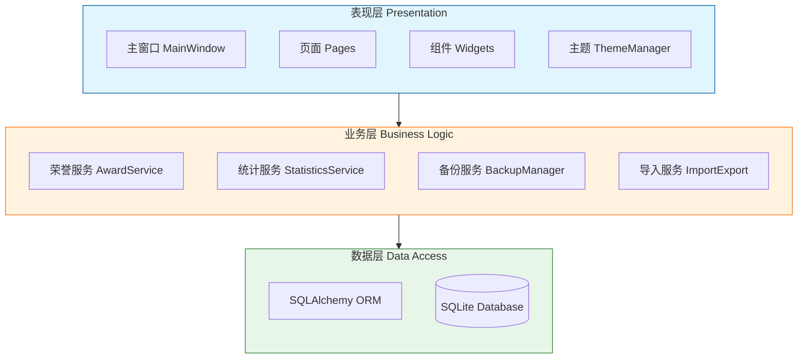

<div align="center">
  <!-- Logo Section -->
  
  

  <!-- Typing Effect Title -->
  <h1>荣誉证书管理系统</h1>
  <a href="https://git.io/typing-svg">
    
  </a>

  <p>
    一款功能完整、界面精美的荣誉证书管理桌面应用。<br/>
    支持荣誉证书的全生命周期管理：从录入、统计分析、成员管理到附件管理，一应俱全。
  </p>

  <!-- Badges -->
  <p>
    
    
    
    
  </p>

  <!-- Action Buttons -->
  <p>
    <a href="#-快速开始">
      
    </a>
    &nbsp;
    <a href="https://github.com/RE-TikaRa/Certificate-Management/issues">
      
    </a>
    &nbsp;
    <a href="#-文件目录说明">
      
    </a>
  </p>
</div>

---

<!-- Table of Contents -->
<details>
  <summary><strong>📖 目录导航 (点击展开)</strong></summary>

- [✨ 核心特性](#-核心特性)
  - [🎯 功能详情](#-功能详情)
- [🛠️ 技术栈](#️-技术栈)
- [📸 界面预览](#-界面预览)
- [🚀 快速开始](#-快速开始)
  - [📥 安装步骤](#-安装步骤)
  - [🛠️ 常用命令](#️-常用命令)
  - [🤖 MCP / AI 接入](#-mcp--ai-接入)
  - [📂 文件目录说明](#-文件目录说明)
  - [🏗️ 项目架构](#️-项目架构)
  - [💾 数据模型](#-数据模型)
  - [🏆 荣誉记录 (Awards)](#-荣誉记录-awards)
  - [👤 参与成员 (TeamMembers)](#-参与成员-teammembers)
  - [🎓 专业与学校 (Majors/Schools)](#-专业与学校-majorsschools)
- [🔐 数据安全与备份](#-数据安全与备份)
- [🎨 主题系统](#-主题系统)
- [🛠️ 开发指南](#️-开发指南)
- [🧰 故障排查](#-故障排查)
- [📈 Star History](#-star-history)
- [🤝 如何贡献](#-如何贡献)
- [📄 许可证](#-许可证)

</details>

---

## ✨ 核心特性

<div align="center">
  <table>
    <tr>
      <td align="center" width="25%">
        <h3>⚡ 极速检索</h3>
        <p>500ms 防抖全文检索<br/>FTS5 引擎加持</p>
      </td>
      <td align="center" width="25%">
        <h3>📊 数据可视化</h3>
        <p>8 张动态指标卡<br/>图表实时联动</p>
      </td>
      <td align="center" width="25%">
        <h3>🧭 丝滑体验</h3>
        <p>页面异步懒加载<br/>启动速度飞快</p>
      </td>
      <td align="center" width="25%">
        <h3>🛡️ 数据安全</h3>
        <p>本地 SQLite 存储<br/>自动定时备份</p>
      </td>
    </tr>
    <tr>
      <td align="center">
        <h3>🧠 智能补全</h3>
        <p>专业/学院自动匹配<br/>支持拼音/代码搜索</p>
      </td>
      <td align="center">
        <h3>🗑️ 后悔药</h3>
        <p>回收站机制<br/>双重删除确认</p>
      </td>
      <td align="center">
        <h3>🎨 炫彩主题</h3>
        <p>深色/浅色模式<br/>一键实时切换</p>
      </td>
      <td align="center">
        <h3>🛠️ 运维工具</h3>
        <p>一键清理日志/备份<br/>数据库维护工具</p>
      </td>
    </tr>
  </table>
</div>

### 🎯 功能详情

- **仪表盘**: 实时指标卡片 (总数/级别/等级)，饼图/柱状图可视化，最近录入速览。
- **荣誉管理**: 完整字段录入 (比赛/日期/级别/等级/证书号)，多成员动态卡片管理。
- **智能搜索**: 基于 2025 教育部目录，支持中文/拼音/代码模糊搜索，自动回退匹配。
- **高级筛选**: 多维度排序 (8种)，组合筛选 (等级/奖项/日期)，CSV/XLSX 导入导出。
- **系统设置**: 自动备份频率，数据目录迁移，日志级别控制，一键重置；提供 MCP 服务开关、Web 依赖安装入口与导入模板下载。
- **AI 接入**: 内置本地 MCP（stdio/SSE）与可选 Web 控制台，默认只读，支持 PII 脱敏与写入开关。

---

## 🛠️ 技术栈

<div align="center">

| **核心框架** | **数据存储** | **工具链** |
| :---: | :---: | :---: |
|  |  |  |
|  |  |  |

</div>

- **AI/MCP**：`mcp`（FastMCP），支持 stdio/SSE；可选 `gradio` Web 控制台
- **日志**：`loguru`（应用日志与 MCP 进程日志输出到 `logs/`）
- **类型检查**：`pyright`（标准模式）+ `ruff`（风格/未使用项）

---

## 📸 界面预览

> 💡 **提示**: 点击图片可查看大图

<div align="center">
  <table>
    <tr>
      <td align="center">
        
        <br/><b>🏠 首页</b><br/>快速导航与最近动态
      </td>
      <td align="center">
        
        <br/><b>📊 仪表盘</b><br/>指标卡 + 统计图表
      </td>
    </tr>
    <tr>
      <td align="center">
        
        <br/><b>📝 录入页</b><br/>成员卡片式表单
      </td>
      <td align="center">
        
        <br/><b>👀 总览页</b><br/>FTS5 搜索 + 筛选排序
      </td>
    </tr>
    <tr>
      <td align="center">
        
        <br/><b>👥 成员管理</b><br/>10 字段监控与详情
      </td>
      <td align="center">
        
        <br/><b>⚙️ 设置页</b><br/>主题/备份/清理/日志
      </td>
    </tr>
  </table>
</div>

---

## 🚀 快速开始

<div align="center">
  
  
  
</div>

### 📥 安装步骤

1. **克隆仓库**
   ```bash
   git clone https://github.com/RE-TikaRa/Certificate-Management.git
   cd Certificate-Management
   ```

2. **安装依赖** (推荐使用 `uv`)
   ```bash
   # 安装 uv (如果尚未安装)
   # pip install uv

   # 同步环境
   uv sync
   ```

3. **启动应用**
   ```bash
   # Windows 快捷启动
   ./main.bat

   # 或使用 uv 启动
   uv run python -m src.main
   ```

### 🛠️ 常用命令

| 操作 | 命令 | 说明 |
| :--- | :--- | :--- |
| **运行** | `uv run python -m src.main` | 启动主程序 |
| **调试** | `uv run python -m src.main --debug` | 开启调试日志 |
| **检查** | `uv run ruff check .` | 代码 Lint 检查 |
| **格式化** | `uv run ruff format .` | 代码自动格式化 |
| **MCP 服务** | `uv run certificate-mcp` | 启动 MCP（默认 stdio，只读） |
| **MCP SSE** | `CERT_MCP_TRANSPORT=sse uv run certificate-mcp` | 启动 SSE（默认 `http://127.0.0.1:8000/sse`；推荐用设置页随软件启动） |
| **MCP Web** | `uv run certificate-mcp-web` | 启动本地 Web 控制台（需安装可选依赖） |

---

### 🤖 MCP / AI 接入

- **推荐方式：stdio（由客户端拉起进程）**
  - 启动：`uv run certificate-mcp`
  - 适用：支持“本地命令型 MCP”的客户端（无需开端口）
- **可选方式：SSE（本地 URL）**
  - URL：`http://127.0.0.1:8000/sse`
  - 启动（推荐）：设置页 → MCP 服务 → 开启“随软件启动 MCP”
  - 启动（手动）：`CERT_MCP_TRANSPORT=sse CERT_MCP_PORT=8000 uv run certificate-mcp`
  - 日志：`logs/mcp_sse.log`

<details>
<summary><strong>Windows PowerShell 启动 SSE（手动）</strong></summary>

```powershell
$env:CERT_MCP_TRANSPORT = "sse"
$env:CERT_MCP_HOST = "127.0.0.1"
$env:CERT_MCP_PORT = "8000"
uv run certificate-mcp
```

</details>
- **可选：Web 控制台（便于调试/验收 MCP 输出）**
  - 安装依赖：`uv sync --group mcp-web`（也可在设置页一键安装/更新）
  - 运行：`uv run certificate-mcp-web`（默认 `127.0.0.1:7860`）
  - 认证：使用设置页配置的用户名/密码（修改后需重启 MCP Web 进程生效）
  - 日志：`logs/mcp_web.log`（安装/更新日志见 `logs/mcp_web_install.log`）
- **权限与安全**
  - 默认只读：不允许写入数据库/文件；可在设置页或 `CERT_MCP_ALLOW_WRITE=1` 开启（仅本地自用）
  - 附件读取限额：`CERT_MCP_MAX_BYTES`（默认 1MB），避免一次读取超大文件
  - PII 脱敏：`CERT_MCP_REDACT_PII`（默认开启），对身份证/手机号等做掩码处理
  - 本项目 MCP 仅供本地使用：请保持绑定 `127.0.0.1`，不要对公网/局域网暴露端口
- **环境变量（常用）**
  - MCP：`CERT_MCP_TRANSPORT`（stdio/sse/streamable-http）、`CERT_MCP_HOST`、`CERT_MCP_PORT`、`CERT_MCP_ALLOW_WRITE`、`CERT_MCP_REDACT_PII`、`CERT_MCP_MAX_BYTES`、`CERT_MCP_DEBUG`
  - MCP Web：`CERT_MCP_WEB_HOST`、`CERT_MCP_WEB_PORT`、`CERT_MCP_WEB_USERNAME`、`CERT_MCP_WEB_PASSWORD`、`CERT_MCP_WEB_INBROWSER`
- **能力概览**
  - Tools：`health`、`list_awards`、`search_awards`、`get_award`、`list_members`、`get_member`、`read_attachment`
  - Resources：`schema://models`、`templates://awards_csv`

<details>
<summary><strong>📎 客户端配置示例（stdio）</strong></summary>

```json
{
  "mcpServers": {
    "certificate": {
      "command": "uv",
      "args": ["run", "certificate-mcp"],
      "env": {
        "CERT_MCP_ALLOW_WRITE": "0",
        "CERT_MCP_REDACT_PII": "1"
      }
    }
  }
}
```

</details>

<details>
<summary><strong>📎 客户端配置示例（SSE）</strong></summary>

```json
{
  "mcpServers": {
    "certificate": {
      "type": "sse",
      "url": "http://127.0.0.1:8000/sse"
    }
  }
}
```

</details>

## 📂 文件目录说明

<details>
<summary><strong>点击展开完整目录树</strong></summary>

```
Certificate-Management/
├── 📄 README.md                    # 项目文档
├── ⚙️ pyproject.toml               # 依赖配置
├── 🔒 uv.lock                      # 依赖锁定
├── 🚀 main.bat                     # Windows 启动脚本
├── 🚫 .gitignore                   # Git 忽略规则
├── 🧰 tools/                       # 开发辅助脚本（可选）
│
├── 📦 src/                         # 源代码
│   ├── 🏁 main.py                  # 入口文件
│   ├── 🌍 app_context.py           # DI 容器
│   ├── ⚙️ config.py                # 配置加载
│   ├── 📝 logger.py                # 日志配置
│   ├── 🤖 mcp/                     # MCP 模块（本地）
│   │   ├── server.py               # MCP 服务端（默认只读）
│   │   ├── web.py                  # MCP 本地 Web 控制台（可选）
│   │   ├── helpers.py              # MCP 配置/解析辅助
│   │   └── runtime.py              # MCP 进程/自启动管理（本地）
│   │
│   ├── 💾 data/                    # 数据层
│   │   ├── models.py               # SQLAlchemy 模型
│   │   └── database.py             # 数据库会话
│   │
│   ├── 🔧 services/                # 业务层
│   │   ├── award_service.py        # 荣誉逻辑
│   │   ├── statistics_service.py   # 统计分析
│   │   ├── import_export.py        # 导入导出
│   │   └── ...
│   │
│   ├── 🎨 ui/                      # 表现层
│   │   ├── main_window.py          # 主窗口
│   │   ├── styled_theme.py         # 主题管理
│   │   ├── pages/                  # 各功能页面
│   │   └── widgets/                # 自定义组件
│   │
│   └── 📂 resources/               # 静态资源
│       ├── styles/                 # QSS 样式
│       └── templates/              # 导入模板
│
├── 📂 data/                        # 数据库存储 (自动生成)
├── 📂 attachments/                 # 附件存储
├── 📂 backups/                     # 自动备份
├── 📂 logs/                        # 运行日志
└── 📂 docs/                        # 文档与参考数据
```
</details>

---

## 🏗️ 项目架构



> **架构说明**：本项目采用经典的三层架构（表现层、业务层、数据层），各层职责分明，通过依赖注入（DI）容器 `AppContext` 进行解耦。

---

## 💾 数据模型

<details>
<summary><strong>查看详细数据库表结构</strong></summary>

### 🏆 荣誉记录 (Awards)
| 字段 | 类型 | 说明 |
| :--- | :--- | :--- |
| `id` | Integer | 主键 |
| `competition_name` | String | 比赛名称 |
| `award_date` | Date | 获奖日期 |
| `level` | String | 级别（国家/省/校等） |
| `rank` | String | 等级（一/二/三/优秀） |
| `certificate_code` | String | 证书编号 |
| `remarks` | Text | 备注 |
| `attachment_folder` | String | 附件目录相对路径 |
| `deleted` / `deleted_at` | Bool/DateTime | 软删除标记 |
| `created_at` / `updated_at` | DateTime | 时间戳 |
| `members` | Relation | 多对多成员 |
| `attachments` | Relation | 附件（级联删除） |

### 👤 参与成员 (TeamMembers)
| 字段 | 类型 | 说明 |
| :--- | :--- | :--- |
| `id` | Integer | 主键 |
| `name` | String | 姓名 |
| `gender` | String | 性别 |
| `id_card` | String | 身份证号（唯一） |
| `phone` | String | 手机号 |
| `student_id` | String | 学号（唯一） |
| `email` | String | 邮箱 |
| `school` / `school_code` | String | 学校名称/标识码 |
| `major` / `major_code` | String | 专业名称/代码 |
| `class_name` | String | 班级 |
| `college` | String | 学院 |
| `pinyin` | String | 姓名拼音 |
| `active` | Bool | 启用状态 |
| `sort_index` | Integer | 排序权重 |
| `created_at` / `updated_at` | DateTime | 时间戳 |
| `awards` | Relation | 多对多荣誉 |

### 🎓 专业与学校 (Majors/Schools)
| 模型 | 关键字段 | 说明 |
| :--- | :--- | :--- |
| `Major` | `name`(唯一), `code`(唯一), `pinyin`, `category`, `discipline_code/name`, `class_code/name`, 时间戳 | 2025 本科专业目录（约 840 条） |
| `School` | `name`(唯一), `code`(唯一), `pinyin`, `region`, 时间戳 | 全国高校列表 |
| `SchoolMajorMapping` | `school_name/code`, `major_name/code`, `college_name`, `category`, `discipline_*`, `class_*` | 学校-专业-学院映射，支持代码缺失时按名称回退 |
| `Attachment` | `award_id`, `stored_name`, `original_name`, `relative_path`(唯一), `file_md5`, `file_size`, `deleted`, 时间戳 | 附件记录 |
| `BackupRecord` / `ImportJob` | 路径/状态/消息/时间戳 | 备份与导入任务记录 |

*(更多模型细节请查阅源码 `src/data/models.py`)*
</details>

---

## 🔐 数据安全与备份

<div align="center">
  <table>
    <tr>
      <td width="50%">
        <h4>🛡️ 本地优先</h4>
        <p>数据存于 <code>data/awards.db</code>，附件在 <code>attachments/</code>，默认不上传云端。</p>
      </td>
      <td width="50%">
        <h4>🔄 自动备份</h4>
        <p>支持每日/每周/启动前自动备份，恢复前可自动创建还原点。</p>
      </td>
    </tr>
    <tr>
      <td>
        <h4>🗑️ 回收站</h4>
        <p>删除荣誉进入回收站可恢复；附件删除会移入 <code>attachments/.trash</code>。</p>
      </td>
      <td>
        <h4>🧹 清理策略</h4>
        <p>提供日志/备份/数据库清理工具，操作前需双重确认。</p>
      </td>
    </tr>
  </table>
</div>

> ⚠️ **隐私提醒**：请勿将 `data/`、`backups/`、`attachments/`、`logs/`、`.env` 等敏感目录提交到版本控制系统。

---

## 🎨 主题系统

应用内置了一套精美的色彩系统，适配深色/浅色模式。

| 指标类型 | 渐变色 (Light -> Dark) | 语义 |
| :--- | :--- | :--- |
| **总荣誉** | `💜 #a071ff` → `#7b6cff` | 综合实力 |
| **国家级** | `💙 #5a80f3` → `#4ac6ff` | 最高荣誉 |
| **省级** | `💛 #ffb347` → `#ffcc33` | 中坚力量 |
| **校级** | `💚 #3ec8a0` → `#45dd8e` | 基础积累 |
| **一等奖** | `💠 #00b4d8` → `#48cae4` | 顶尖表现 |
| **三等奖** | `❤️ #ff6b6b` → `#ff8787` | 鼓励奖项 |

---

## 🛠️ 开发指南

1. **环境准备**: 确保 Python 3.14+，推荐使用 `uv` 管理虚拟环境。
2. **新增页面**: 继承 `BasePage`，在 `main_window.py` 中注册路由。
3. **数据库变更**: 修改 `models.py`，目前使用自动建表，生产环境建议引入 Alembic。
4. **代码规范**: 提交前请运行 `ruff check` 和 `pyright`。

---

## 🧰 故障排查

<details>
<summary><strong>点击查看常见问题解决方案</strong></summary>

| 问题现象 | 可能原因 | 解决方案 |
| :--- | :--- | :--- |
| **启动缺少 Qt 插件** | 环境依赖不完整 | 运行 `uv sync`，若无效则删除 `.venv` 重试 |
| **界面文字乱码** | 字体缺失或编码问题 | 检查系统字体，确认未强制覆盖 `QFontDatabase` |
| **数据库被锁** | 异常退出导致锁文件残留 | 关闭应用，删除 `data/awards.db-shm` 和 `.db-wal` |
| **导入无响应** | 模板格式错误 | 确认 CSV/XLSX 表头与模板一致，查看设置页日志 |
| **MCP 连接失败** | 端口未启动/URL 错误/依赖缺失 | SSE：确认 `http://127.0.0.1:8000/sse` 且设置页已启动；Web：先 `uv sync --group mcp-web`，再用设置页用户名/密码登录 |
| **主题不更新** | 信号未连接 | 检查 `__init__` 是否连接 `themeChanged` 信号 |
| **附件校验失败** | 文件被占用或修改 | 检查文件权限，清空回收站后重试 |

</details>

---

## 📈 Star History

<a href="https://star-history.com/#RE-TikaRa/Certificate-Management&Date">
 <picture>
   <source media="(prefers-color-scheme: dark)" srcset="https://api.star-history.com/svg?repos=RE-TikaRa/Certificate-Management&type=Date&theme=dark" />
   <source media="(prefers-color-scheme: light)" srcset="https://api.star-history.com/svg?repos=RE-TikaRa/Certificate-Management&type=Date" />
   
 </picture>
</a>

---

## 🤝 如何贡献

非常欢迎您的贡献！请遵循以下流程：

1. Fork 本仓库
2. 创建特性分支 (`git checkout -b feature/AmazingFeature`)
3. 提交更改 (`git commit -m 'Add some AmazingFeature'`)
4. 推送到分支 (`git push origin feature/AmazingFeature`)
5. 提交 Pull Request

---

## 📄 许可证

本项目基于 [MIT License](LICENSE) 开源。

---

<div align="center">
  <p>
    <b>Author:</b> <a href="https://github.com/RE-TikaRa">RE-TikaRa</a> |
    <b>Powered by:</b> PySide6 & QFluentWidgets
  </p>
  
  <p>
    <a href="https://github.com/RE-TikaRa/Certificate-Management/stargazers">
      
    </a>
    <a href="https://github.com/RE-TikaRa/Certificate-Management/network/members">
      
    </a>
  </p>
</div>
